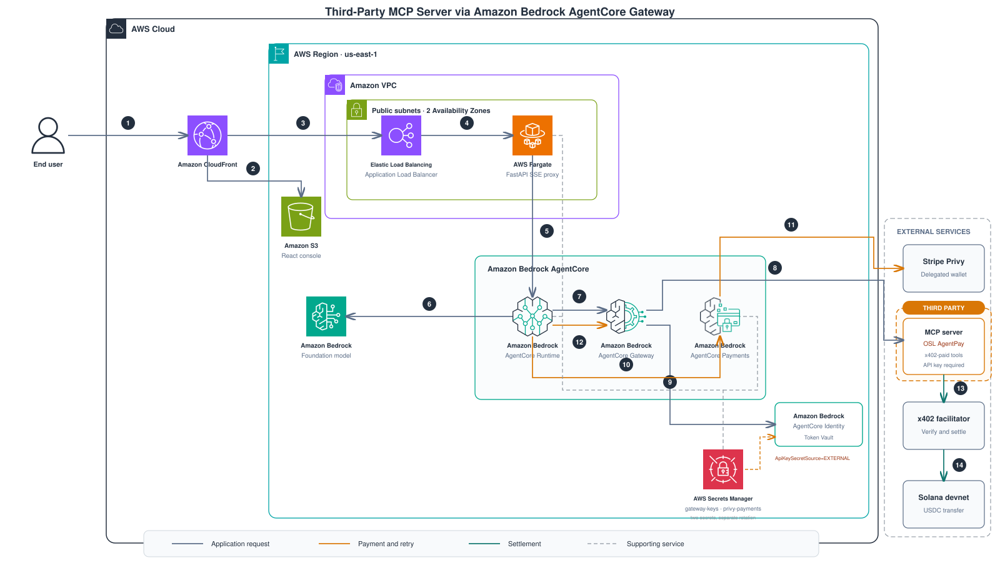
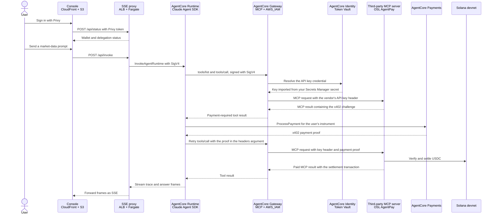

# Third-Party MCP Server Integration for Amazon Bedrock AgentCore Gateway

Connect an MCP server you do **not** host to **Amazon Bedrock AgentCore Gateway**, when that server
requires an **API key** — and keep the key out of your code, your CloudFormation templates, and your
agent's process.

The worked example is [OSL AgentPay](https://api-glb.osl.com), a third-party MCP server whose market
data tools are billed per call over the x402 protocol. It is a realistic case: someone else's
endpoint, someone else's header convention, someone else's price.

## Table of Contents

- [Solution Overview](#solution-overview)
- [Architecture Diagram](#architecture-diagram)
- [AWS CDK and Constructs](#aws-cdk-and-constructs)
- [Prerequisites](#prerequisites)
- [Customizing the Solution](#customizing-the-solution)
- [Build and Deploy](#build-and-deploy)
- [Constraints worth knowing](#constraints-worth-knowing)
- [Run an End-to-End Paid Call](#run-an-end-to-end-paid-call)
- [Connecting a Different MCP Server](#connecting-a-different-mcp-server)
- [Development and Testing](#development-and-testing)
- [Security Considerations](#security-considerations)
- [Acknowledgements](#acknowledgements)
- [License](#license)

## Solution Overview

An agent on **AgentCore Runtime** reaches the third-party tools only through **AgentCore Gateway**.
When the credential provider is created, AgentCore imports the vendor's API key from your
**Secrets Manager** secret into **AgentCore Identity's Token Vault**. The Gateway then resolves that
credential from the Token Vault and injects it into each outbound request, so the key never reaches
the agent:

| Direction | Authorization |
|---|---|
| agent → Gateway (**inbound**) | AWS IAM. The Runtime's execution role SigV4-signs its MCP calls, so there is no user pool, no client secret, nothing to rotate. |
| Gateway → vendor (**outbound**) | The vendor's API key, resolved from the Token Vault and placed in the header the vendor requires. Its initial value comes from a Secrets Manager secret you own. |

The key is registered as an `AWS::BedrockAgentCore::ApiKeyCredentialProvider` with
**`ApiKeySecretSource=EXTERNAL`**, which points AgentCore at your Secrets Manager secret instead of
embedding a value. That distinction is the whole point: the CDK L2 `ApiKeyCredentialProvider` takes
`api_key: SecretValue`, which writes the key into the synthesized template and into every
deployment's history. `EXTERNAL` is not a live reference: changing the secret value does not update
an existing credential provider. The rotation step is documented under
[Customizing the Solution](#customizing-the-solution).

Because OSL's tools are x402-paid, the sample also carries the payment loop: the agent receives an
HTTP 402 challenge, signs it through **AgentCore Payments** with a delegated **Stripe Privy** wallet,
and retries. Settlement is USDC on **Solana devnet**. If your third-party server is free, that half
is inert — see [Connecting a Different MCP Server](#connecting-a-different-mcp-server).

The deployed environment is:

- a React and Privy console on **Amazon S3 + Amazon CloudFront**;
- a Server-Sent Events (SSE) proxy on **Amazon ECS Fargate behind an Application Load Balancer**;
- an ARM64 **AgentCore Runtime** that streams model, tool, payment, and retry events;
- an IAM-authorized **AgentCore Gateway** with one `mcpServer` target and an API-key credential
  provider; and
- **AgentCore Payments** resources connected to a delegated Stripe Privy wallet.

## Architecture Diagram

### System architecture

<p align="center">
  
</p>

> The third-party MCP server sits **outside** the AWS boundary; everything the Gateway presents to it
> is configuration you own. See the [numbered walkthrough](docs/architecture.md).

### Paid-call sequence



The agent never holds the vendor key: it appears only on the `GW → MCP` hop, injected by the Gateway
after the Token Vault resolves it.

Two details of that sequence are forced by the protocols, not chosen:

- **The target is `mcpServer`, not OpenAPI.** x402 is an HTTP *header* protocol, and a Gateway cannot
  inject a retry header into an upstream request. So the challenge and the proof both travel inside
  the MCP payload — the challenge in `structuredContent`, the proof as a `headers` **argument**.
  Arguments cross a Gateway hop; headers do not.
- **The settlement transaction is read from `structuredContent`, not a response header.** A Gateway
  forwards `structuredContent` but drops upstream response headers, so a caller behind a Gateway
  would otherwise see a paid result and never learn which transaction it paid for.

The browser never invokes the Runtime directly. CloudFront routes `/api/*` to the ALB, and the
Fargate proxy calls `InvokeAgentRuntime` with its task role. The proxy owns the HTTP socket so it can
forward each Runtime frame immediately; a Lambda behind API Gateway would buffer the response instead
of streaming it.

## AWS CDK and Constructs

Infrastructure is Python AWS CDK, synthesized, tested and deployed through projen and `uv`. The app
creates one stack, `agentcore-x402-dev`:

- **`McpGateway`** (`infra/gateway.py`) creates the AWS-IAM-authorized Gateway, registers the
  vendor's API key as an `ApiKeyCredentialProvider` with `ApiKeySecretSource=EXTERNAL`, and adds one
  `mcpServer` target that presents the key in the vendor's header. **This is the construct the sample
  is about**; the header name, the JSON key and the secret name are all parameters.
- **`PaymentsResources`** (`infra/payments.py`) creates the AgentCore Payment Credential Provider,
  Payment Manager, connector, and service role, reading provider secrets from
  `agentcore-x402/privy-payments`.
- **`AgentRuntime`** (`infra/agent_runtime.py`) builds the ARM64 agent image from
  `src/agentcore/runtime/demo_agent/` and grants the Runtime access to Bedrock, Payments, Gateway,
  and the Privy lookup secret.
- **`StreamProxy`** (`infra/stream_proxy.py`) deploys the FastAPI proxy from
  `src/fargate/stream_proxy/` as one ARM64 Fargate task behind an internet-facing ALB.
- **`Console`** (`infra/console.py`) deploys `src/web/dist/` to a private S3 bucket behind CloudFront
  and routes `/api/*` to the ALB origin.

The stack emits `RuntimeArn`, `GatewayMcpUrl`, `GatewayArn`, `PaymentManagerArn`,
`PaymentConnectorId`, `StreamProxyUrl`, and `ConsoleUrl`. `cdk-nag` applies `AwsSolutionsChecks`;
suppressions are explicit in the construct that owns the resource.

## Prerequisites

- An AWS account with Amazon Bedrock AgentCore Runtime, Gateway, Identity and Payments available,
  plus access to the configured Amazon Bedrock model.
- AWS credentials for the target account, AWS CDK bootstrapped in `us-east-1`, and Docker running.
- Python 3.13+, `uv`, and Node.js 22+.
- **An API key for the third-party MCP server.** For OSL AgentPay, request one from OSL.
- For the payment half (needed only if your third-party tools charge):
  - a Stripe Privy app with app ID, wallet authorization key ID, app secret, and authorization
    private key;
  - a Privy-embedded user wallet funded with Solana devnet USDC. The facilitator sponsors transaction
    fees, so the payer wallet does not need SOL.

Useful AWS references:

- [AgentCore Gateway core concepts](https://docs.aws.amazon.com/bedrock-agentcore/latest/devguide/gateway-core-concepts.html)
- [MCP servers as Gateway targets](https://docs.aws.amazon.com/bedrock-agentcore/latest/devguide/gateway-target-MCPservers.html)
- [Process an x402 payment with AgentCore Payments](https://docs.aws.amazon.com/bedrock-agentcore/latest/devguide/payments-process-payment.html)

## Customizing the Solution

Copy the committed template to the git-ignored settings file:

```bash
cp settings_sample.py settings.py
```

| Setting | Purpose |
|---|---|
| `THIRD_PARTY_MCP_URL` | **Required.** The third-party MCP endpoint; it is the Gateway's only target |
| `AGENT_MODEL_ID` | **Required.** Amazon Bedrock model ID used by the Claude Agent SDK |
| `PAYMENT_PROVIDER` | `StripePrivy` for the included Solana devnet flow |
| `PRIVY_APP_ID` | **Required for the paid OSL example.** Privy application identifier used by Payments, Runtime, proxy, and console |
| `PRIVY_AUTH_ID` | **Required for the paid OSL example.** Privy wallet authorization key ID used for delegation |
| `VITE_PRIVY_APP_ID` | Optional console override; otherwise uses `PRIVY_APP_ID` |
| `VITE_PRIVY_SIGNER_ID` | Optional console override; otherwise uses `PRIVY_AUTH_ID` |

For OSL AgentPay the URL is `https://api-glb.osl.com/v1/agentpay/market-data/mcp`. **Note the `/mcp`
suffix** — the service root is a descriptor, not an MCP endpoint, and a target pointed at the root
fails with a confusing 500 rather than a clear error.

Nothing in `settings.py` is a secret. Create **two** Secrets Manager secrets before deploying, kept
apart on purpose: a vendor rotating an API key has nothing to do with wallet credentials, and one
shared document would mean every rotation rewrites both and every reader is granted both.

```bash
# 1. The Gateway's outbound key(s). JSON key name must match `key_json_key` in infra/gateway.py.
aws secretsmanager create-secret --region us-east-1 \
  --name agentcore-x402/gateway-keys \
  --description 'Outbound API keys AgentCore Gateway presents to third-party MCP targets' \
  --secret-string '{"OSL_GATEWAY_KEY":"<the vendor API key>"}'

# 2. Payment provider credentials (only needed if the third-party tools charge).
aws secretsmanager create-secret --region us-east-1 \
  --name agentcore-x402/privy-payments \
  --secret-string '{"PRIVY_APP_SECRET":"...","PRIVY_AUTH_PRIVATE_KEY":"..."}'
```

Verify the endpoint and key **before** deploying — a target that cannot list tools rolls the stack
back:

```bash
uv run python scripts/probe_third_party_mcp.py \
  https://api-glb.osl.com/v1/agentpay/market-data/mcp \
  --secret-id agentcore-x402/gateway-keys --json-key OSL_GATEWAY_KEY
```

It exits `0` when the endpoint is usable, `1` when `tools/list` fails, and `2` when the endpoint
answers *without* the key — which means the credential is gating nothing and is worth raising with
the vendor. The key is never accepted as a command-line argument, because that puts it in shell
history and the process list.

AgentCore materializes a credential when the provider is **created**, so rotating the secret value
alone does not refresh it. After a rotation, bump the `name` suffix in `infra/gateway.py` to force
CloudFormation to replace the provider.

## Build and Deploy

1. Clone and install:

   ```bash
   git clone <this repository>
   cd <this repository>
   uv sync --group dev
   npx projen
   ```

2. Create `settings.py` and the two Secrets Manager secrets, then run the probe above.

3. Validate:

   ```bash
   npx projen lint
   npx projen test
   ```

4. Select the account and Region:

   ```bash
   export CDK_DEFAULT_ACCOUNT="$(aws sts get-caller-identity --query Account --output text)"
   export CDK_DEFAULT_REGION=us-east-1
   export AWS_REGION=us-east-1
   ```

5. Review and deploy:

   ```bash
   npx projen diff
   npx cdk diff --method=template agentcore-x402-dev
   npx projen deploy agentcore-x402-dev
   ```

   The first command is the repository's standard CDK diff task. Also run the template-method diff
   when reviewing this integration: the default change-set diff does **not** report property changes
   on `AWS::BedrockAgentCore::GatewayTarget`, so a changed header name or credential can be invisible
   in the review.

   `npx projen deploy` runs `build:web` before `cdk deploy` so it never ships a stale console bundle.

6. To remove the stack:

   ```bash
   npx projen destroy agentcore-x402-dev
   ```

## Constraints worth knowing

Four AgentCore behaviours that each cost a rollback or a silent failure here. None is documented
where you would look for it, and each is now enforced by a test or pinned by a comment in
`infra/gateway.py`. Read these before changing the credential, the header, or a construct id.

**1. You cannot send a bare, unprefixed key.** `CredentialPrefix` has `minLength: 1`, so `""` passes
`cdk synth` and then fails CloudFormation early validation:

```
#/.../ApiKeyCredentialProvider/CredentialPrefix: expected minLength: 1, actual: 0
```

A single space is the shortest legal prefix, and HTTP strips optional whitespace around a header
value, so the server observes the bare key. The default is `Bearer `, which for a header named
`X-Vendor-Key` would put `Bearer <key>` on the wire — a value the vendor rejects, with nothing on the
Gateway side reporting that the header was rewritten.

**2. The L2 silently skips its own secret grant for a token ARN.**
`GatewayCredentialProvider.from_api_key_identity_arn(secret_arn=...)` turns that ARN into a
`secretsmanager:GetSecretValue` grant **only when it is a resolved literal**. A CDK token
(`Fn::Join`) is skipped without warning, and the credential then resolves to a 403 at tool-call time.
`infra/gateway.py` adds `key_secret.grant_read(role)` explicitly. Note also that
`Secret.from_secret_name_v2().secret_arn` omits the 6-character suffix Secrets Manager appends, so
the grant needs the `-??????` wildcard.

**3. A `GatewayTarget` validates its endpoint at deploy time.** On create *and* on update it connects
to the MCP server and calls `tools/list` with the configured credential. A rejected call fails
stabilization and rolls back the whole stack:

```
GatewayTarget ... failed to stabilize, reason: Failed to connect and fetch tools
from the provided MCP target server. Error - Authorization error when sending message
```

This is a feature — a misconfigured credential fails the deployment instead of 401ing in production
— and it is why `scripts/probe_third_party_mcp.py` exists and why
[Customizing the Solution](#customizing-the-solution) tells you to run it first.

**4. Credential provider names are unique per token vault.** Renaming the CDK construct changes the
CloudFormation logical id, so a deploy tries to CREATE a second provider holding a name the first one
still owns:

```
Credential provider with name: ... already exists (ValidationException, 400)
```

Rename the construct only together with a bump to its `name`.

## Run an End-to-End Paid Call

```bash
aws cloudformation describe-stacks --stack-name agentcore-x402-dev --region us-east-1 \
  --query "Stacks[0].Outputs[].{Key:OutputKey,Value:OutputValue}" --output table
```

During create and update, CloudFormation makes the Gateway target call `tools/list`; deployment
fails if the endpoint or outbound credential is wrong. After deployment, inspect the target's
control-plane status:

```bash
aws bedrock-agentcore-control list-gateway-targets --region us-east-1 \
  --gateway-identifier <gateway-id> --query 'items[].{name:name,status:status}' --output table
```

This command does not invoke a tool. It confirms the deployed target state; the full path below is
the end-to-end exercise of Runtime, Gateway, vendor authentication, payment, retry, and settlement.

Then the full user path:

1. Open `ConsoleUrl` and sign in with the email linked to the Privy application.
2. If the wallet shows `provisioning…`, send one prompt. The first paid call creates the user's
   AgentCore Payments instrument; refresh to load the new wallet address.
3. Send Solana devnet USDC to the displayed agent wallet.
4. Choose **Delegate signing to the agent** and wait for the console to confirm the backend
   delegation state.
5. Send one of the built-in prompts:
   - `What's the current price of bitcoin?` → `crypto_price`
   - `What's the USD to Hong Kong dollar rate?` → `fiat_rate`
   - `How much is one ETH in Indonesian rupiah?` → `cross_quote`
6. The console's trace pane streams tool discovery, the x402 challenge, `ProcessPayment`, the Gateway
   retry, and the settlement transaction.

The trace is streamed to the browser. Money-relevant events are also emitted as JSON log records by
`demo_agent.trace`: challenge details, payment instrument ID, `processPaymentId`, errors, and the
settlement transaction. The log payload uses a field allowlist and excludes API keys, authorization
values, and payment proofs. After deployment, verify those records reach the Runtime log group:

```bash
aws logs tail /aws/bedrock-agentcore/runtimes/<runtime-id>-DEFAULT --region us-east-1 --since 20m
```

## Connecting a Different MCP Server

Everything vendor-specific is a parameter of `McpGateway`:

```python
McpGateway(
    self,
    "Gateway",
    mcp_url="https://vendor.example.com/mcp",
    key_header="X-Vendor-Api-Key",              # whatever the vendor requires
    key_json_key="VENDOR_API_KEY",              # JSON key inside the secret
    key_secret_name="agentcore-x402/gateway-keys",
)
```

Checklist:

1. Run `scripts/probe_third_party_mcp.py` against the endpoint with `--header` set to the vendor's
   header name. Do not deploy until it exits `0`.
2. Add the key to the `gateway-keys` secret under a new JSON key.
3. Set `key_header` and `key_json_key`. The prefix stays a single space; see
   [Constraints worth knowing](#constraints-worth-knowing).
4. If the vendor's tools are **free**, the payment path simply never triggers: no 402 means the agent
   returns the first result. The Payments resources can then be removed along with `PRIVY_*`.

## Development and Testing

Run the console locally against the deployed Fargate proxy:

```bash
npx projen dev:web
```

Privy must allow `http://localhost:5173` as an application origin. The dev server generates
`src/web/.env.local` from `settings.py` and the deployed `StreamProxyUrl`.

```bash
npx projen lint       # ruff check + formatting
npx projen test       # pytest, including CDK synth assertions on the Gateway target
npx projen build      # full release build
npx projen run-hooks  # full-repository pre-commit audit
```

The Gateway tests synthesize a bare stack holding only `McpGateway`, never the whole app: the other
constructs build Docker images from the repository root, and hashing that root once turned a 0.7s
test into 155.7s in CI.

## Security Considerations

- **The agent never sees the vendor key.** It is resolved by AgentCore Identity and injected by the
  Gateway on the outbound hop. It is not in the agent image, an environment variable, the request, or
  the browser bundle.
- **The key is not in the template.** `ApiKeySecretSource=EXTERNAL` references your Secrets Manager
  secret, so the value stays out of the synthesized template and out of deployment history.
- **Least privilege on the secret.** The Gateway role is granted read on the `gateway-keys` secret
  only. Payment provider credentials live in a separate secret with separate readers.
- **Separate secrets, separate rotation.** Rotating a vendor API key does not touch wallet
  credentials and vice versa.
- **Verified per-user identity.** The Runtime derives the payment subject from the verified Privy
  token `sub` and resolves the linked email through Privy. It does not trust a user ID or email from
  the request body.
- **Server-side payment signing.** The agent calls `ProcessPayment`; no blockchain private key is
  placed in the agent image, request, or browser bundle.
- **IAM service boundaries.** The proxy invokes the Runtime with its ECS task role; the Runtime
  invokes the Gateway with its execution role. Gateway inbound authorization is `AWS_IAM`.
- **Payment audit fields.** The Runtime emits allowlisted payment events, including
  `processPaymentId` and the settlement transaction, to its logger as well as the browser trace.
  Verify CloudWatch delivery, retention, and access controls in your deployment before treating
  those logs as an audit record.
- **Development topology.** The Runtime uses public networking and the SSE proxy runs in public
  subnets behind an internet-facing ALB. Add production authentication, VPC design, TLS to the
  origin, access logging, WAF, spend limits, and `(network, asset, payTo)` allowlists before using
  real funds.

## Acknowledgements

The payer design is adapted from
[`aws-samples/sample-agentcore-cloudfront-x402-payments`](https://github.com/aws-samples/sample-agentcore-cloudfront-x402-payments).

## License

SPDX-License-Identifier: MIT-0

See [`LICENSE`](LICENSE).
